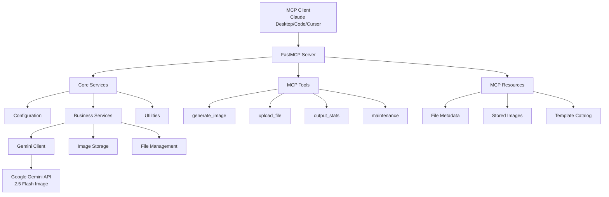
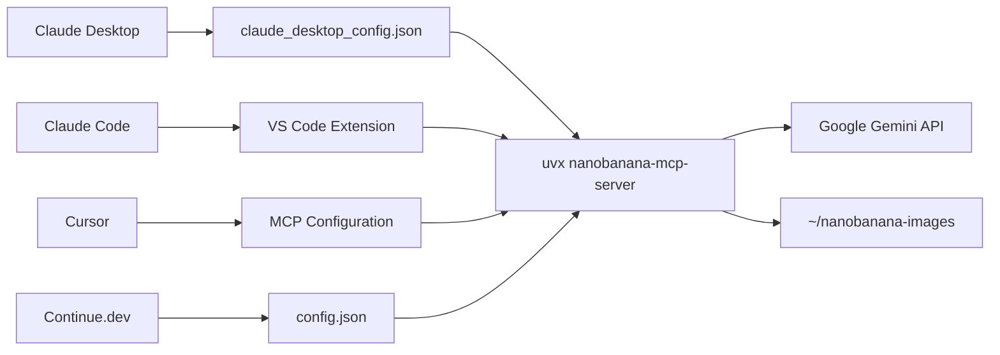

# Nano Banana MCP Server - Project Overview

## 🎯 Project Summary

**Nano Banana MCP Server** is a production-ready Model Context Protocol (MCP) server that brings AI-powered image generation capabilities to any MCP-compatible client through Google's Gemini 2.5 Flash Image model.

### Key Value Propositions
- **Universal Integration** - Works with Claude Desktop, Claude Code, Cursor, Continue.dev, and any MCP client
- **Zero-Configuration** - Simple `uvx` installation with smart defaults
- **Production-Ready** - Comprehensive error handling, logging, and validation
- **Professional Templates** - Pre-built prompt templates for photography, design, and editing

## 🏗️ Architecture Overview

### System Architecture

### Package Architecture
- **Layered Design** - Clear separation between transport, business logic, and external services
- **Dependency Injection** - Service registry pattern for clean dependencies
- **Modular Components** - Tools, resources, and prompts as separate modules
- **Configuration Management** - Environment-based configuration with smart defaults

## 🔧 Technical Implementation

### Core Technologies
| Component | Technology | Version | Purpose |
|-----------|------------|---------|---------|
| **MCP Framework** | FastMCP | ≥2.11.0 | Server foundation and protocol handling |
| **AI Integration** | Google GenAI | ≥0.3.0 | Gemini 2.5 Flash Image API |
| **Image Processing** | Pillow | ≥10.4.0 | Image manipulation and optimization |
| **Validation** | Pydantic | ≥2.0.0 | Data validation and serialization |
| **Package Management** | uv | Latest | Modern Python tooling |

### Development Principles
- **Type Safety** - Full type annotations with mypy checking
- **Code Quality** - Ruff linting with strict rules
- **Testing** - Comprehensive test suite with pytest
- **Documentation** - Inline documentation and external guides

## 📦 Package Structure

### Distribution Strategy
- **PyPI Package** - `pip install nanobanana-mcp-server`
- **uvx Execution** - `uvx nanobanana-mcp-server@latest`
- **Development Install** - `uv sync` for local development
- **Console Scripts** - `nanobanana-mcp-server` and `nanobanana-mcp` commands

### Build System
- **Modern Build Backend** - Hatchling with proper package configuration
- **Automated Publishing** - Scripts for building and uploading to PyPI
- **Version Management** - Centralized version in `__init__.py` and `pyproject.toml`
- **Lock File** - `uv.lock` for reproducible builds

## 🎨 Feature Implementation

### Image Generation Pipeline
1. **Input Validation** - Pydantic models for request validation
2. **Prompt Processing** - Template application and enhancement
3. **API Communication** - Gemini client with retry logic and error handling
4. **Image Processing** - Format validation, optimization, and metadata extraction
5. **Storage Management** - Optional local storage with TTL cleanup
6. **Response Formatting** - MCP-compliant tool results with mixed content

### Template System
- **Photography Templates** - Professional photography prompts
- **Design Templates** - Logo and graphic design prompts
- **Editing Templates** - Image modification and style transfer
- **Parameterized Prompts** - Dynamic template variables
- **MCP Resources** - Template discovery through resource protocol

### File Management
- **Gemini Files API** - Upload and manage large files
- **Local Storage** - Temporary image storage with automatic cleanup
- **Metadata Tracking** - File information and usage statistics
- **Resource Endpoints** - Access files through MCP resource URIs

## 🚀 Deployment Architecture

### Client Integration

### Configuration Strategy
- **Environment Variables** - API keys and optional settings
- **Smart Defaults** - User home directory for storage
- **Cross-Platform** - Works on macOS, Windows, Linux
- **No Setup Required** - Automatic directory creation and configuration

## 📊 Performance Characteristics

### Scalability Metrics
- **Image Generation** - ~3-5 seconds per image (Gemini API dependent)
- **File Upload** - Limited by network speed and file size
- **Memory Usage** - Minimal baseline, scales with concurrent requests
- **Storage** - Local storage with automatic cleanup

### Resource Management
- **Concurrent Requests** - Configurable limit (default: 10)
- **Image Storage** - TTL-based cleanup (default: 1 hour)
- **Error Recovery** - Automatic retry with exponential backoff
- **Logging** - Structured logging with configurable levels

## 🔒 Security Implementation

### Input Validation
- **Pydantic Models** - Strict type validation on all inputs
- **File Size Limits** - Configurable limits for uploads
- **Path Sanitization** - Safe file path handling
- **Error Sanitization** - Production mode masks sensitive information

### API Security
- **Environment Variables** - API keys never hardcoded
- **Request Validation** - All API requests validated before sending
- **Error Handling** - Graceful degradation without information leakage
- **Logging Security** - Sensitive data excluded from logs

## 🛠️ Development Workflow

### Development Environment
1. **Clone Repository** - `git clone https://github.com/zhongweili/nanobanana-mcp-server.git`
2. **Install Dependencies** - `uv sync`
3. **Environment Setup** - Copy `.env.example` and add API key
4. **Local Development** - `uv run python -m nanobanana_mcp_server.server`
5. **Testing** - `pytest` for test suite

### Quality Assurance
- **Code Formatting** - `ruff format .`
- **Linting** - `ruff check .`
- **Type Checking** - `mypy .`
- **Testing** - `pytest --cov=.`
- **Build Validation** - `uv run python scripts/build.py`

### Publishing Process
1. **Version Update** - Update version in `__init__.py` and `pyproject.toml`
2. **Build Package** - `uv run python scripts/build.py`
3. **Test Upload** - `uv run python scripts/upload.py` → TestPyPI
4. **Production Upload** - `uv run python scripts/upload.py` → PyPI
5. **Verification** - Test installation with `uvx nanobanana-mcp-server@latest`

## 📈 Future Roadmap

### Immediate Enhancements (v0.2.0)
- **Image Editing Tools** - Direct image editing capabilities
- **Batch Processing** - Multiple image generation in single request
- **Enhanced Templates** - More specialized prompt templates
- **Performance Optimization** - Caching and request optimization

### Medium-term Goals (v0.3.0)
- **Custom Templates** - User-defined template system
- **Advanced Storage** - Cloud storage integration options
- **Monitoring Dashboard** - Usage statistics and performance metrics
- **API Extensions** - Additional Gemini model support

### Long-term Vision (v1.0.0)
- **Multi-Model Support** - Integration with other AI image models
- **Plugin System** - Extensible architecture for third-party tools
- **Enterprise Features** - Advanced authentication and access control
- **Web Interface** - Optional web UI for direct access

## 🎯 Success Metrics

### Adoption Metrics
- **PyPI Downloads** - Package installation statistics
- **GitHub Stars** - Community interest and adoption
- **Issue Resolution** - Support response and fix times
- **Client Compatibility** - Support across MCP clients

### Technical Metrics
- **Uptime** - Server stability and reliability
- **Response Times** - Image generation and API response speeds
- **Error Rates** - Failure rates and error recovery
- **Resource Usage** - Memory and CPU efficiency

### Quality Metrics
- **Code Coverage** - Test coverage percentage
- **Documentation Coverage** - API and user documentation completeness
- **User Satisfaction** - Feedback and feature requests
- **Security Posture** - Vulnerability assessments and fixes

---

*This project overview provides a comprehensive view of the Nano Banana MCP Server architecture, implementation, and roadmap. For specific technical details, refer to the individual documentation files in the `/docs` directory.*