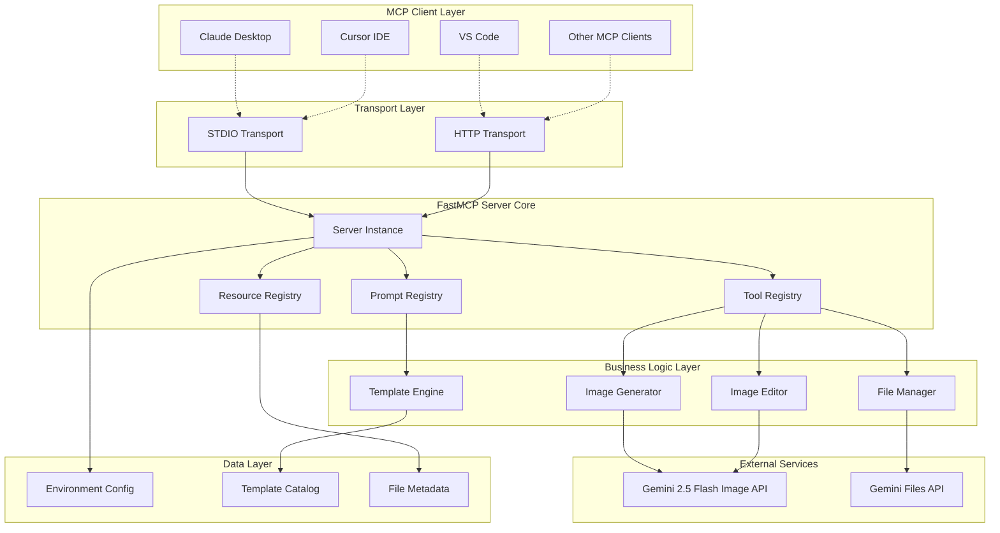
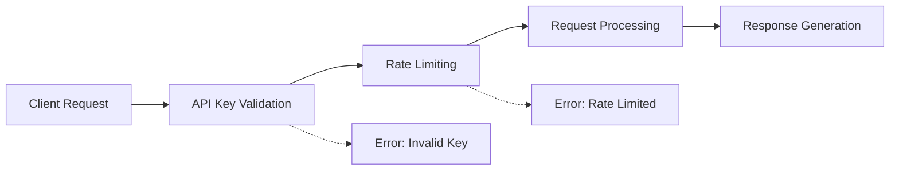
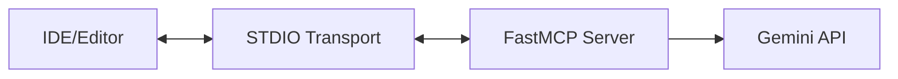
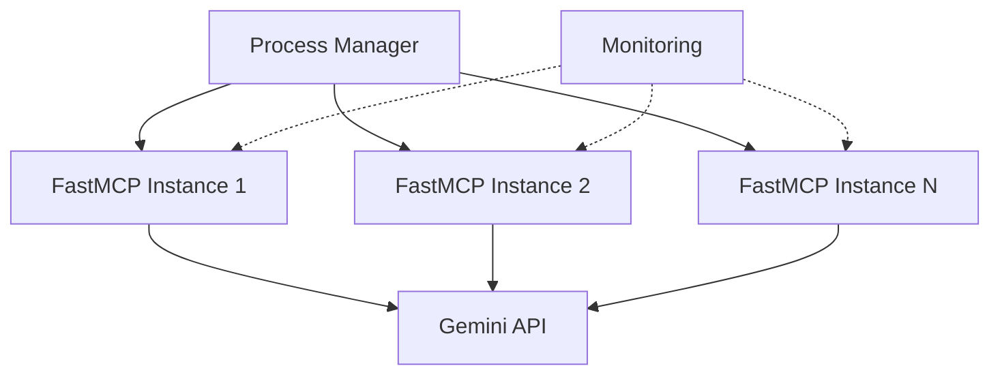

# Nano Banana MCP Server - System Design

## Overview

The Nano Banana MCP Server is a production-ready FastMCP server that provides AI-powered image generation and editing capabilities through Google's Gemini 2.5 Flash Image model. It implements the Model Context Protocol (MCP) to enable seamless integration with AI development tools like Claude Desktop, Cursor, and VS Code.

## System Architecture



## Core Components

### 1. FastMCP Server Core

**Primary Class**: `FastMCP`
- **Responsibility**: Central server orchestration and MCP protocol handling
- **Key Features**:
  - Transport abstraction (STDIO/HTTP)
  - Component registration and discovery
  - Error handling and validation
  - Client connection management

### 2. Image Generation Service

**Component**: `ImageGenerator`
- **Tools**: `generate_image`
- **Capabilities**:
  - Multi-image generation (1-4 images)
  - Prompt-based generation with aspect ratio control
  - Negative prompt filtering
  - Input image conditioning for style transfer
  - SynthID watermark preservation

**Data Flow**:
```
Prompt → Gemini API → Image Bytes → MCP Image Blocks → Client
```

### 3. Image Editing Service

**Component**: `ImageEditor`
- **Tools**: `edit_image`
- **Capabilities**:
  - Conversational editing instructions
  - Style-preserving modifications
  - Precise object addition/removal
  - Lighting and perspective consistency

### 4. File Management Service

**Component**: `FileManager`
- **Tools**: `upload_file`
- **Resources**: `gemini://files/{name}`
- **Capabilities**:
  - Large file handling (>20MB)
  - File metadata introspection
  - Reusable asset management
  - URI-based file referencing

### 5. Template Engine

**Component**: `TemplateEngine`
- **Resources**: `nano-banana://prompt-templates`
- **Prompts**: 6 predefined templates
- **Capabilities**:
  - Reusable prompt generation
  - Parameter validation
  - Template discovery and cataloging

## API Design

### Tool Interface

```typescript
interface Tool {
  name: string;
  description: string;
  parameters: ParameterSchema;
  handler: (params: any, context: Context) => ToolResult;
}

interface ToolResult {
  content: (string | ImageContent)[];
  structured_content?: Record<string, any>;
}
```

### Resource Interface

```typescript
interface Resource {
  uri: string;
  handler: (params: any) => any;
}
```

### Prompt Interface

```typescript
interface Prompt {
  name: string;
  parameters: ParameterSchema;
  handler: (...args: any[]) => string;
}
```

## Security Architecture

### Authentication & Authorization



**Security Layers**:
1. **Environment Variable Protection**: API keys stored securely
2. **Early Validation**: Fail-fast on missing credentials
3. **Error Masking**: Optional error detail concealment
4. **Transport Security**: HTTPS for HTTP transport mode

### Data Protection

- **No Persistent Storage**: Images processed in-memory only
- **SynthID Tracking**: Watermark metadata for provenance
- **Secure Transmission**: Binary data handled through MCP protocol
- **API Rate Limits**: Inherited from Gemini API constraints

## Performance Characteristics

### Throughput Capacity

| Operation | Expected Latency | Concurrent Users | Memory Usage |
|-----------|------------------|------------------|--------------|
| Single Image Generation | 3-8 seconds | 10-20 | ~50MB peak |
| Image Editing | 2-5 seconds | 15-25 | ~30MB peak |
| File Upload | 1-30 seconds* | 5-10 | ~File Size |
| Template Access | <100ms | 100+ | ~1KB |

*Depends on file size and network conditions

### Scalability Considerations

**Horizontal Scaling**:
- Stateless server design enables load balancing
- File uploads can be distributed across instances
- Template caching reduces repeated computations

**Vertical Scaling**:
- Memory scales with concurrent image processing
- CPU scales with image encoding/decoding operations
- Network bandwidth critical for large file transfers

## Configuration Management

### Environment Variables

```bash
# Required
GEMINI_API_KEY=your_gemini_api_key
# or
GOOGLE_API_KEY=your_google_api_key

# Optional
FASTMCP_TRANSPORT=stdio|http
FASTMCP_HOST=127.0.0.1
FASTMCP_PORT=9000
FASTMCP_MASK_ERRORS=true|false
```

### Runtime Configuration

```python
mcp = FastMCP(
    name="nanobanana-mcp-server",
    instructions="Server description...",
    mask_error_details=True,  # Production security
)
```

## Deployment Architecture

### Local Development



**Setup**:
```bash
# Install uv if not already available
curl -LsSf https://astral.sh/uv/install.sh | sh

# Create project and install dependencies
uv init --python 3.11
uv add fastmcp google-genai pillow python-dotenv
uv add --dev ruff pytest pytest-asyncio

# Set up environment
export GEMINI_API_KEY=your_key

# Run server
uv run python server.py
```

### FastMCP Native Deployment

**STDIO Mode (Default)**:
```bash
# Direct execution via FastMCP
uv run python server.py

# Or via FastMCP CLI if available
fastmcp run nanobanana-mcp-server
```

**HTTP Mode (Remote Access)**:
```bash
# Enable HTTP transport in server.py
# mcp.run(transport="http", host="0.0.0.0", port=8000)
uv run python server.py

# Or with environment variables
FASTMCP_TRANSPORT=http FASTMCP_PORT=8000 uv run python server.py
```

**Production Deployment**:


**Process Management**:
```bash
# Using systemd service
sudo systemctl start nanobanana-mcp-server
sudo systemctl enable nanobanana-mcp-server

# Using PM2 or similar process manager
pm2 start "uv run python server.py" --name nanobanana-mcp-server
```

**Production Features**:
- FastMCP native HTTP transport
- Built-in health monitoring
- Automatic error recovery
- Environment-based configuration
- Process manager integration

## Error Handling Strategy

### Error Categories

1. **Configuration Errors**: Missing API keys, invalid settings
2. **API Errors**: Gemini service failures, rate limits
3. **Validation Errors**: Invalid parameters, malformed requests
4. **Runtime Errors**: Memory issues, network failures

### Recovery Mechanisms

```python
def handle_gemini_error(error):
    if isinstance(error, RateLimitError):
        return retry_with_backoff()
    elif isinstance(error, AuthError):
        return fail_fast_with_message()
    else:
        return graceful_degradation()
```

## Quality Assurance

### Testing Strategy

**Unit Tests**:
- Tool parameter validation
- Image processing logic
- Template generation
- Error handling paths

**Integration Tests**:
- Gemini API interaction
- File upload/download cycles
- MCP protocol compliance
- Transport layer functionality

**Performance Tests**:
- Concurrent request handling
- Memory usage profiling
- Large file processing
- Rate limit validation

### Monitoring & Observability

**Key Metrics**:
- Request latency distribution
- Error rate by operation type
- Memory usage patterns
- API quota consumption
- Concurrent connection counts

**Logging Strategy**:
- Structured JSON logging
- Request/response tracing
- Error context preservation
- Performance metrics collection

## Future Enhancements

### Phase 2 Features

1. **Batch Processing**: Multiple image operations in single request
2. **Caching Layer**: Intelligent result caching for common prompts
3. **Webhook Support**: Async processing with callbacks
4. **Advanced Templates**: User-defined prompt templates
5. **Analytics Dashboard**: Usage metrics and insights

### Scalability Improvements

1. **Distributed Processing**: Queue-based async processing
2. **CDN Integration**: Global image delivery optimization
3. **Database Layer**: Persistent session and history management
4. **Auto-scaling**: Dynamic instance management based on load

This system design provides a robust foundation for the Nano Banana MCP Server while maintaining flexibility for future enhancements and scaling requirements.