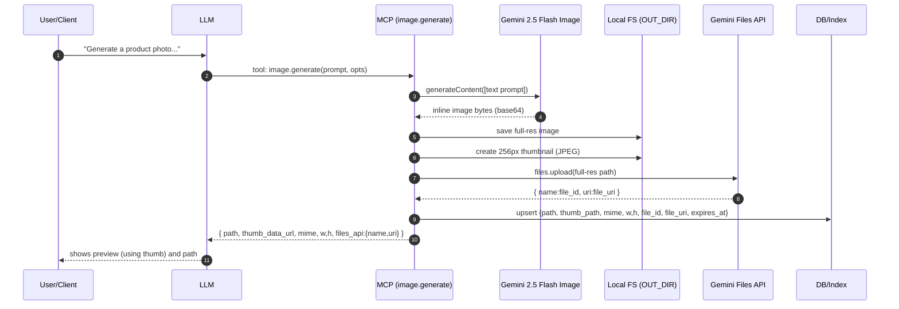
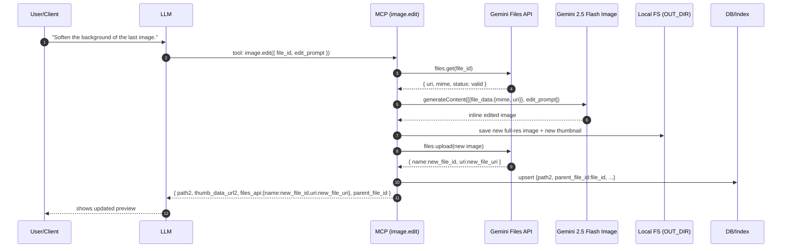
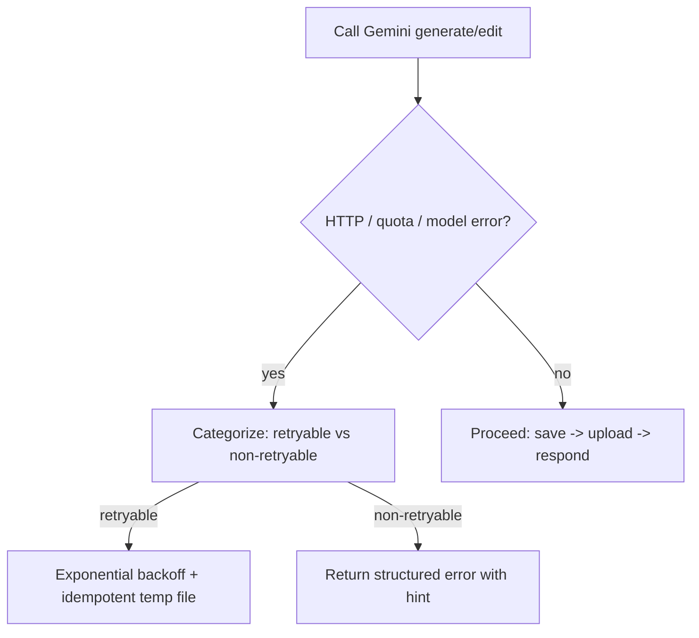

# Typical Workflows





```mermaid
flowchart TD
    A[image.edit({file_id, edit_prompt})] --> B[files.get(file_id)]
    B -->|expired or not found| C[Lookup local path by file_id in DB]
    C -->|path found| D[files.upload(path) -> new_file_id]
    C -->|path missing| E[Return error: artifact unavailable]
    D --> F[Call model with file_data{uri:new}]
    B -->|valid uri| F[Call model with file_data{uri:existing}]
    F --> G[Save new image to OUT_DIR]
    G --> H[Create thumbnail]
    H --> I[files.upload(new image) -> new_file_id2]
    I --> J[DB upsert: new record with parent_file_id]
    J --> K[Return tool result: path, thumb, files_api]
```

```mermaid
flowchart TD
    A[image.edit({path, edit_prompt})] --> B[Validate path under OUT_DIR]
    B -->|invalid| C[Return error: path outside OUT_DIR]
    B -->|valid| D{File exists?}
    D -->|no| E[Return error: not found]
    D -->|yes| F{Large file or multi-turn?}
    F -->|yes| G[files.upload(path) -> file_id, uri]
    F -->|no| H[Optional: inline upload via prompt]
    G --> I[Call model with file_data{uri}]
    H --> I[Call model with inline/streamed bytes]
    I --> J[Save edited image to OUT_DIR]
    J --> K[Make thumbnail]
    K --> L[files.upload(edited) -> new_file_id]
    L --> M[Return {path, thumb, files_api}]
```

```mermaid
flowchart TD
    subgraph Maintenance / Quota & Hygiene
    A[Scheduled task (e.g., hourly)] --> B[Scan DB for Files API expirations (~48h TTL)]
    B --> C{Expired in Files API?}
    C -->|yes| D[If needed, re-upload from local before next edit]
    C -->|no| E[No action]
    A --> F[Local LRU/age-based cleanup of OUT_DIR]
    F --> G{Keep latest + referenced by DB?}
    G -->|no| H[Delete old artifacts & thumbs]
    G -->|yes| I[Retain]
    A --> J[Check project storage budget (Files API ~20GB)]
    J --> K{Over budget soon?}
    K -->|yes| L[Delete unreferenced remote files or shorten retention]
    K -->|no| M[Do nothing]
    end
```


